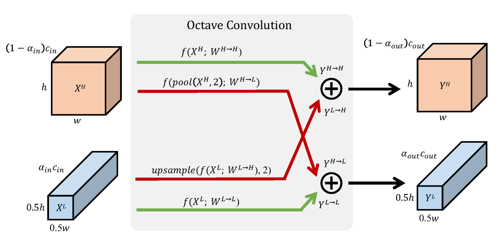

# OctaveConv-Pytorch
PyTorch implementation of [Drop an Octave: Reducing Spatial Redundancy in Convolutional Neural Networks with Octave Convolution](https://arxiv.org/pdf/1904.05049.pdf)

(training in progress)

from [MXNET implementation](https://github.com/terrychenism/OctaveConv)
